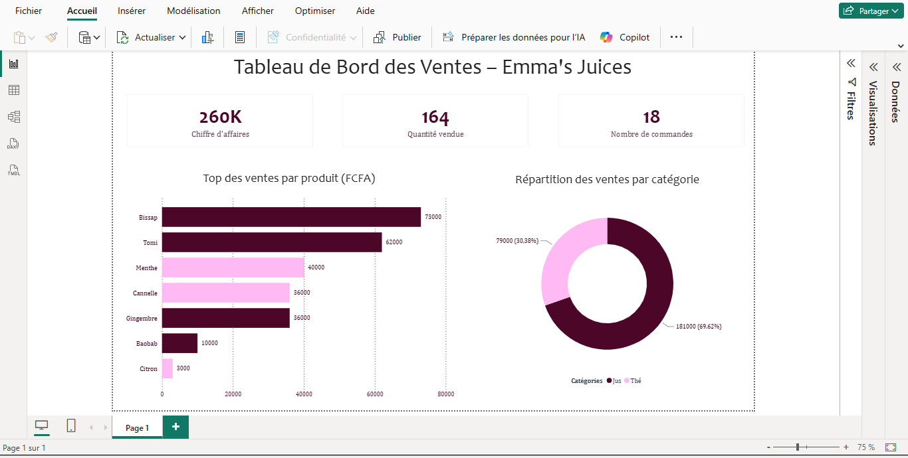

# 🍹 Emma Juices Pop-Up Store – Analyse des Performances de Ventesysis



## 📌 Présentation du Projet

Emma Juices est un pop-up store proposant des jus naturels et des thés artisanaux.

L'objectif de ce projet est d'analyser les ventes du mois de juin afin d'aider la direction à mieux comprendre les performances commerciales, identifier les produits les plus rentables et produire un tableau de bord d'aide à la décision.

---

# 🎯 Questions Business

Cette analyse répond aux questions suivantes :

* Quel produit génère le plus de chiffre d'affaires ?
* Quelle catégorie (Jus ou Thé) est la plus performante ?
* Quel est le panier moyen des commandes ?
* Les modes de paiement sont-ils équilibrés ?
* Quels produits doivent être priorisés en stock ?
* Quels produits nécessitent une amélioration ou une révision de l'offre ?

---

# 📁 Structure du Projet 

```text
emma-juices/
│
├── data/
│   ├── raw_data.xlsx
│   └── cleaned_data.xlsx
│
├── sql/
│   └── business_queries.sql
│
├── python/
│   └── data_cleaning.py
│
├── dashboard/
│   ├── emma_juices.pbix
│   └── dashboard_preview.png
│
└── README.md
```

---

# 🛠️ Stack Technique

| Outil                         | Utilisation                                                |
| ----------------------------- | ---------------------------------------------------------- |
| **Excel**                     | Exploration initiale, contrôle qualité et nettoyage manuel |
| **Python (pandas)**           | Nettoyage automatisé et préparation des données            |
| **SQL**                       | Analyse métier et calcul des indicateurs                   |
| **Power BI**                  | Création d'un tableau de bord interactif                   |
| **Statistiques descriptives** | Moyenne, médiane et interprétation des données             |

---

# 🧹 Nettoyage de données

Avant toute analyse, les données ont été contrôlées afin de garantir leur qualité.

Les principales corrections réalisées sont :

### Standardisation des produits

* correction des fautes de frappe
* uniformisation des majuscules/minuscules
* suppression des variations d'écriture

Exemple :

```
ctron → Citron
gingembre → Gingembre
CANNELLE → Cannelle
```

### Harmonisation des catégories

Certaines boissons étaient associées à plusieurs catégories.

Une règle métier a été appliquée afin d'assurer une catégorisation cohérente.

Exemple :

```
Tomi → Jus
```

### Complétion des valeurs manquantes

Les catégories absentes ont été automatiquement complétées à partir du nom du produit.

### Création d'une variable métier

Création de la colonne :

```
Montant_Total = Quantité × Prix_Unitaire
```

Cette variable est utilisée dans l'ensemble des analyses.

---

# 📊 Résultats Clés

| Indicateur               |       Valeur |
| ------------------------ | -----------: |
| Chiffre d'affaires total | 260 000 FCFA |
| Quantité vendue          |   164 unités |
| Panier moyen             |  14 444 FCFA |
| Panier médian            |  11 250 FCFA |

### Performance par catégorie

| Catégorie | Chiffre d'affaires |   Part |
| --------- | -----------------: | -----: |
| Jus       |       181 000 FCFA | 69,6 % |
| Thé       |        79 000 FCFA | 30,4 % |

### Top 3 des produits

| Produit   | Chiffre d'affaires |
| --------- | -----------------: |
| 🥇 Bissap |        73 000 FCFA |
| 🥈 Tomi   |        62 000 FCFA |
| 🥉 Menthe |        40 000 FCFA |

---

# 🔍 Analyse Business 

L'analyse met en évidence plusieurs observations :

* Les jus représentent près de **70 %** du chiffre d'affaires.
* Les produits **Bissap** et **Tomi** génèrent à eux seuls plus de la moitié des ventes.
* Les paiements sont répartis de manière équilibrée entre Espèces, Wave et Orange Money.
* Le panier moyen est supérieur au panier médian, ce qui suggère la présence de quelques commandes de montant élevé.

---

# 💡 Recommendations Business 

À partir des résultats obtenus, plusieurs actions peuvent être envisagées :

* Maintenir un stock suffisant de **Bissap** et **Tomi** afin de limiter les ruptures.
* Revoir le positionnement du thé **Citron**, dont les ventes restent faibles.
* Conserver les trois moyens de paiement disponibles, leur utilisation étant relativement équilibrée.
* Utiliser les produits les plus performants dans les campagnes promotionnelles afin d'augmenter les ventes globales.

---

# ✅ Compétences Démontrées
* Data Cleaning
* Data Quality Assessment
* Excel
* Python (pandas)
* SQL
* Business Analysis
* Descriptive Statistics
* Dashboard Design (Power BI)
* Data Storytelling
